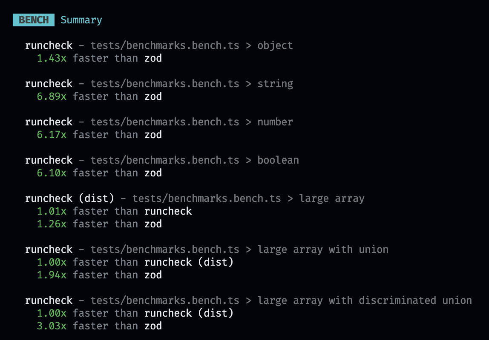

# Runcheck

A lib for js/typescript runtime type checks with autofix support. Runcheck has the goal of being very lightweight and fast ⚡. Because of that, it has only around [2.9kb Gzipped](https://bundlephobia.com/package/runcheck) (at v0.30), has no dependencies and is tree-shakeable!

Benchmarks:



Obs: Runcheck is in Beta and it's api can still change

# Installation

```bash
pnpm add runcheck
```

# Basic types:

| runcheck type                   | ts type equivalent                                |
| ------------------------------- | ------------------------------------------------- |
| `rc_string`                     | `string`                                          |
| `rc_number`                     | `number`                                          |
| `rc_boolean`                    | `boolean`                                         |
| `rc_any`                        | `any`                                             |
| `rc_null`                       | `null`                                            |
| `rc_undefined`                  | `undefined`                                       |
| `rc_date`                       | `Date`                                            |
| `rc_intanceof(instance: T)`     | Classes typecheck in general                      |
| `rc_literals(...literals: T[])` | Type literal in general like `hello`, `true`, `1` |
| `rc_union(...types: T[])`       | Union types in general like `string \| 1`         |
| `rc_array<T>(type: T)`          | `T[]`                                             |
| `rc_tuple<T>(...types: T[])`    | `[T, T]`                                          |

# Array types:

## Array loose check

You can also use `rc_loose_array` to reject the wrong elements of an array and return the valid ones.

```ts
const shape = rc_loose_array(rc_string)

const input = ['hello', 1, 'world']

const result = rc_parse(input, shape)

// result.data will be ['hello', 'world']
// result.warnings will return the warnings about the invalid elements
```

## Checking unique values

With the `rc_array` or `rc_loose_array` type you can also use the `unique` option to check if the array has no duplicated values.

```ts
const shape = rc_array(rc_string, { unique: true })
```

For arrays of objects, you can provide a string to `unique` option to check if the array items has no duplicated values of a specific property.

```ts
const shape = rc_array(rc_object({ id: rc_string }), { unique: 'id' })
```

You can also provide a function to `unique` option to check if the array items has no duplicated values based on a custom function return.

```ts
const shape = rc_array(
  rc_object({ id: rc_string, meta_id: rc_string.optional() }),
  {
    unique: (item) => item.meta_id || item.id,
  },
)
```

# Object types:

## `rc_object`

```ts
const shape = rc_object({
  name: rc_string,
  age: rc_number,
  isCool: rc_boolean,
})
```

The `rc_object` will allow extra properties but, any extra propertie will be striped in parsing. To allow extra in parsing properties, use `rc_extends_obj`.

## `rc_strict_obj`

The same as `rc_object` but, any extra propertie will be throw an error in parsing.

## `rc_obj_intersection`

Allow to merge two `rc_object` types. Example:

```ts
const shape = rc_obj_intersection(
  rc_object({
    name: rc_string,
    age: rc_number,
    isCool: rc_boolean,
  }),
  rc_object({
    address: rc_string,
    phone: rc_string,
  }),
)
```

## `rc_record`

Validates only the values of a object, equivalent to `Record<string, T>` in typescript.

```ts
const shape = rc_record(rc_number)

// shape type is `Record<string, number>`

// `rc_record` also accepts the following options:
const shape = rc_record(rc_number, {
  checkKey: (key) => key !== 'a', // Check if the key is valid
  looseCheck: true, // If true, the invalid keys will be striped
})
```

# Parsing

```ts
import { rc_parse } from 'runcheck'

const input = JSON.parse(jsonInput)

const parseResult = rc_parse(input, rc_array(rc_string))

if (parseResult.error) {
  throw new Error(parseResult.errors.join('\n'))
  // Errors are a array of strings
}

const result = parseResult.data
// Do something with result
```

You can also use `rc_parser` to create a reusable parser.

```ts
import { rc_parser } from 'runcheck'

const parser = rc_parser(rc_array(rc_string))

const parseResult = parser(jsonInput)
const parseResult2 = parser(jsonInput2)
```

# Type assertion

Use `rc_is_valid` and `rc_validator` to do a simple type assertion.

```ts
import { rc_is_valid } from 'runcheck'

const input = JSON.parse(jsonInput)

if (rc_is_valid(input, rc_array(rc_string))) {
  // input will be inferred by ts as `string[]`
}
```

# Type assertion in a parse result

Use `rc_assert_is_valid` to do a simple type assertion in a parse result.

```ts
import { rc_assert_is_valid } from 'runcheck'

const input = JSON.parse(jsonInput)

const result = rc_parse(input, rc_array(rc_string))

rc_assert_is_valid(result, rc_array(rc_string))
// will throw an error if the result is invalid, otherwise will narrow the result type to a valid result
```

# Loose parsing

Use `rc_parse_loose` to parse a input and returning null if the input is invalid.

```ts
import { rc_loose_parse } from 'runcheck'

const input = JSON.parse(jsonInput)

const result = rc_loose_parse(input, rc_array(rc_string)).data

result // string[] | null
```

# Autofixing and fallback values in parsing

Values can be autofixed and fallback values can be provided for parsing. The checks will pass but the result will return warnings messages.

```ts
type SuccessResult = {
  error: false
  data: T
  warnings: string[] | false
}
```

## Fallback

Use the method `rc_[type].withFallback(fallback)` to provide a fallback value if the input is not valid.

```ts
const input = 'hello'

const result = rc_parse(input, rc_string.withFallback('world'))
```

## AutoFix

You can also use `rc_[type].autoFix()` to automatically fix the input if it is not valid.

```ts
const input = 1

const result = rc_parse(
  input,
  rc_string.autoFix((input) => input.toString()),
)
```

There are also some predefined autofixed types that you can import:

```ts
import { rc_string_autofix, rc_boolean_autofix } from 'runcheck/autofixable'

// use like any other type
```

# Performing custom checks

You can also use `rc_[type].where(customCheckFunction)` to perform custom checks.

```ts
const input = 1

const positiveNumberType = rc_number.where((input) => input > 0)
```

# Infer types from schemas

You can use `RcInferType<typeof T>` to infer the types from a schema.

```ts
const schema = rc_object({
  name: rc_string,
  age: rc_number,
  isCool: rc_boolean,
})

export type Person = RcInferType<typeof schema>
```

# Type modifiers

You can use also modiers like `rc_string.optional()` to extend or modify the rc types:

| runcheck modifier      | ts type equivalent       |
| ---------------------- | ------------------------ |
| `rc_[type].optional()` | `T \| undefined`         |
| `rc_[type].orNull()` | `T \| null`              |
| `rc_[type].orNullish()`  | `T \| null \| undefined` |

# Recursive types

You can use `rc_recursive` to create recursive types. But the types can't be inferred in this case. So you need to provide the type manually.

```ts
type MenuTree = {
  name: string
  children: MenuTree[]
}

// the type should be provided manually to the variable in this case
const menuTreeSchema: RcType<MenuTree[]> = rc_array(
  rc_object({
    name: rc_string,
    // you can safely autorefence the schema here
    children: rc_recursive(() => menuTreeSchema),
  }),
)

const result = rc_parse(input, menuTreeSchema)
```

# Transform types

You can use `rc_transform` to validate an input and transform it to another data.

```ts
const input = 'hello'

const result = rc_parse(
  input,
  rc_transform(rc_string, (input) => input.length),
)
```

# Advanced object types

## `rc_rename_from_key`

Allows to rename a key in a object. Example:

```ts
const shape = rc_object({
  name: rc_rename_from_key('oldName', rc_string), // oldName will be renamed to name
  age: rc_number,
  isCool: rc_boolean,
})
```

## Snake case normalization

you can use `rc_object` with the `normalizeKeysFrom` option to normalize the keys of a object to snake case.

```ts
const shape = rc_object(
  {
    name: rc_string,
    age: rc_number,
    isCool: rc_boolean,
  },
  { normalizeKeysFrom: 'snake_case' },
)

rc_parse({ name: 'John', age: 20, is_cool: true }, shape) // will not return an error and will normalize the response to { name: 'John', age: 20, isCool: true }
```

## `rc_get_obj_schema`

Allows to get a subset of a object schema. Example:

```ts
const shape = rc_object({
  name: rc_string,
  age: rc_number,
  isCool: rc_boolean,
})

const nameSchema = rc_get_obj_schema(shape).name
```

## `rc_extends_obj`

Don't strip unchecked keys from the result. Example:

```ts
const shape = rc_object({
  name: rc_string,
})

const result = rc_parse(
  { name: 'John', age: 20, is_cool: true },
  rc_extends_obj(shape),
)

// keys `age` and `is_cool` will be present in the result
result.data // { name: 'John', age: 20, is_cool: true }
```

## `rc_obj_pick`

Allows to pick a subset of a object schema. Example:

```ts
const shape = rc_object({
  name: rc_string,
  age: rc_number,
  isCool: rc_boolean,
})

const nameSchema = rc_obj_pick(shape, ['name'])
```

## `rc_obj_omit`

Allows to omit a subset of a object schema. Example:

```ts
const shape = rc_object({
  name: rc_string,
  age: rc_number,
  isCool: rc_boolean,
})

const baseSchema = rc_obj_omit(shape, ['isCool'])
```

# Other useful utils
